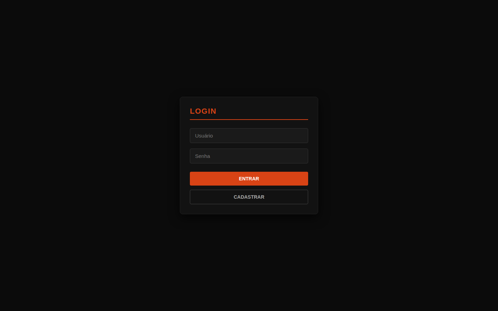
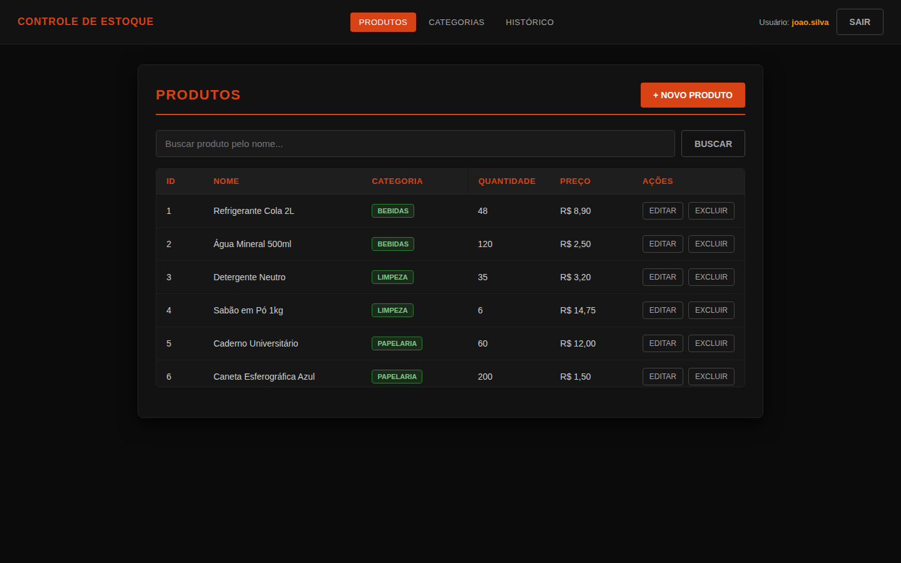
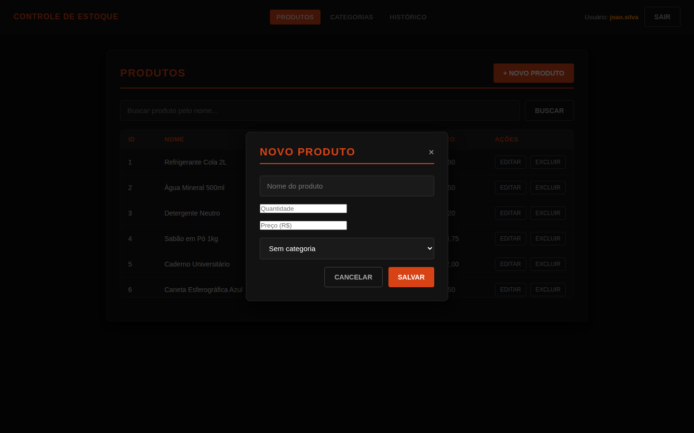
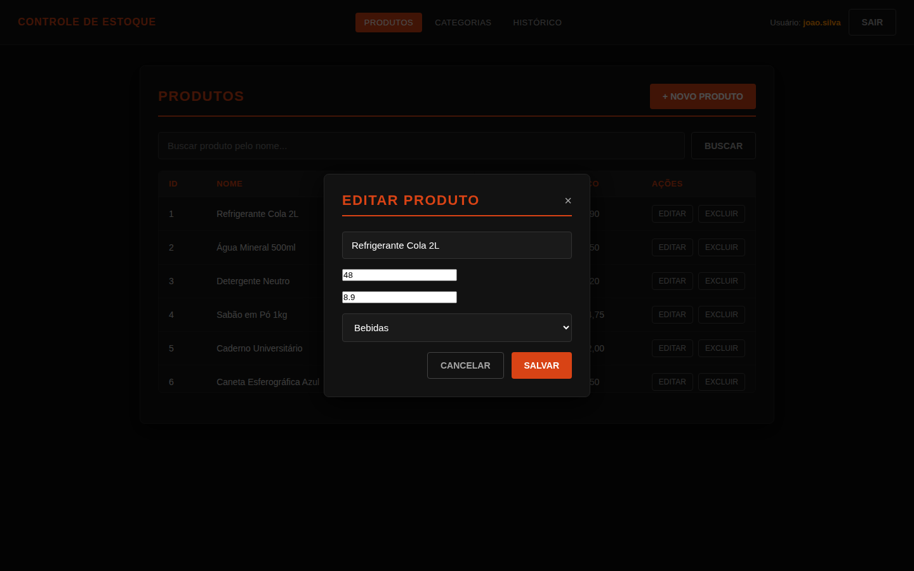
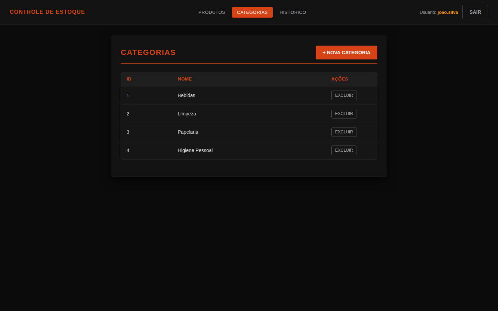
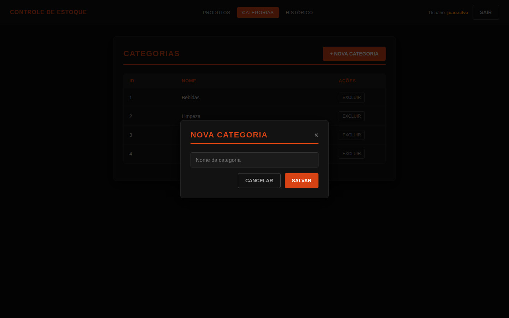
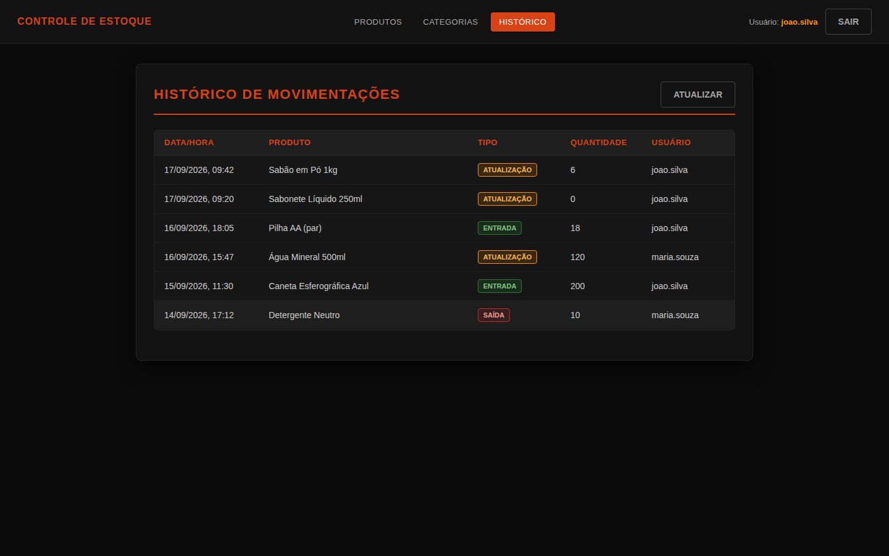

# Controle de Estoque

Sistema web de controle de estoque com gestão de produtos, categorias e histórico de movimentações, com autenticação de usuários. Desenvolvido em Java com Spring Boot, seguindo arquitetura em camadas.

## Telas do sistema

<table>
<tr>
<td><br/><sub>Login</sub></td>
<td><br/><sub>Cadastro de usuário</sub></td>
</tr>
<tr>
<td><br/><sub>Produtos</sub></td>
<td><br/><sub>Novo produto</sub></td>
</tr>
<tr>
<td><br/><sub>Editar produto</sub></td>
<td><br/><sub>Categorias</sub></td>
</tr>
<tr>
<td><br/><sub>Nova categoria</sub></td>
<td><br/><sub>Histórico de movimentações</sub></td>
</tr>
</table>

## Tecnologias

- **Java 25**
- **Spring Boot 4** (Web + Thymeleaf + Actuator)
- **MySQL** (via `mysql-connector-j`)
- **Maven**
- JUnit (testes de controller)

## Funcionalidades

- Autenticação de usuários (login)
- CRUD de **produtos**, com vínculo a categoria e usuário responsável
- CRUD de **categorias**
- Registro de **movimentações de estoque** (entrada/saída), com log e valor total calculado
- Interface web server-side com Thymeleaf

## Arquitetura

Organização em camadas, separando responsabilidades:

```
controle-estoque-spring/
├── src/main/java/.../controller/    # endpoints web (Controller)
├── src/main/java/.../service/       # regras de negócio (Service)
├── src/main/java/.../repository/    # acesso a dados (Repository/DAO)
├── src/main/java/.../model/         # entidades de domínio
├── src/main/resources/templates/    # views (Thymeleaf)
├── src/test/                        # testes automatizados
└── schema.sql                       # script de criação do banco
```

## Como rodar

### Pré-requisitos
- Java 25+
- MySQL Server local
- Maven (ou use o `mvnw` incluso)

### Passos

```bash
# 1. Criar o banco de dados
# execute o script schema.sql no seu MySQL

# 2. Configurar a conexão
cp src/main/resources/application.properties.example src/main/resources/application.properties
# (ou defina as variáveis de ambiente DB_URL, DB_USER, DB_PASSWORD, SERVER_PORT)

# 3. Rodar a aplicação
./mvnw spring-boot:run
```

Acesse `http://localhost:8080`.

## Testes

```bash
./mvnw test
```
